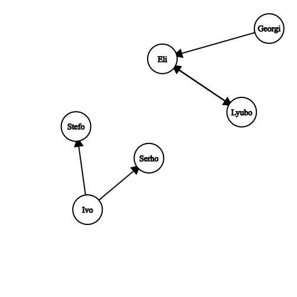

# Тема 1: Структури. Декларация и използване на структури. 

## Задача 0:
N Triangles
Въвежда се цяло число N и после N тригъгълника в равнината, определени от 3 точки ( 6 координати). Отпечатайте тригълниците сортирани по лицата им или по периметър.

## Задача 1:
Да се създаде структура, която представя тримерен вектор с целочислени координати.
- Създайте функция, която събира два вектора и връща нов вектор.
- Създайте функция, която отпечатва координатите на даден вектор.
- Създайте функция, която приема като аргументи 2 вектора и проверява дали те са линейно зависими.

## Задача 2:
Всеки преподавател във ФМИ се определя чрез идентификационен номер, образователна степен (бакалавър, магистър, доктор), брой скъсани студенти. Използвайте изброен тип за образователната степен.Идентификационните номера са винаги петцифрени цели числа.
- Създайте структура описваща преподавател.
- Създайте функция, която приема като аргументи данни, описващи преподавател. Ако данните са валидни, то функцията инициализира преподавател, в противен случай отпечатва подходящо съобщение.
- Да се напише функция, която принтира преподавател. Може да използвате помощни функции.

## Задача 3:
Един университет се състои от краен брой преподаватели. Броят на преподавателите се задава от вас (НЕ се въвежда от входа).
- Създайте структура, която описва университет. Структурата също така трябва да пази средния брой скъсани студенти на преподавателите в университета.
- Направете функция, която създава университет, вземайки информация от стандартния вход. Средният брой скъсани студенти трябва да се сметне след въвеждане на информацията.
- Напишете функция, която приема университет и минимален брой скъсани студенти по договор, и връща колко преподаватели са изпълнили квотата си и съответно ще получат бонус.
- Напишете функция, която сортира преподавателите във възходящ ред спрямо броят студенти, които са скъсали.

## Задача 4 :
Един връх в граф ще описваме чрез етикета във върха, а именно символен низ с дължина максимум 10 символа.
- **1.** Дефинирайте структура, която описва насочено ребро между два върха.
- **2.** Граф дефинираме чрез броят на върховете му, броя на ребрата му и списък на ребрата. Дефинирайте структура, която описва граф  с произволен брой ребра.
- **3.** Създайте функция, която инициализира граф с m ребра. Броят на ребрата се прочита от стандартния вход.

- **4.**  Създайте функция, която приема два върха в граф и добавя ребро между двата върха в графа. Приемаме, че реброто е от първия връх към втория.

  

    <strong>Пример:</strong>
      m = 5  
    Eli Lyubo 
    Lyubo Eli 
    Georgi Eli 
    Ivo Stefo 
    Ivo Serho
  

  

    
  

- **5.** На стандартния вход ви се подават m на брой двойки етикети на върхове. Създайте функция, която обработва гореописания вход и създава граф.
- **6.** Създайте функция, която по подаден връх от граф и граф, намира степента на върха в графа.
- **7.** Създайте функция, която проверява дали граф е пълен. (Граф е пълен, ако всеки връх е свързан с всички останали върхове, считаме че в графа няма примки)
- **8.** Създайте функция, която по дадено ребро и граф, изтрива реброто в графа. Ако подаденото като аргумент ребро не съществува в графа, извежда подходящо съобщение

## Задача 5:
Да се създаде структура `Book` със следните характеристики: заглавие (до 50 символа)
, автор (до 50 символа), жанр и наличност. 
Жанровете са ограничени и могат да бъдат "Роман", "Исторически", "Поезия" и "Друг". 

Да се създаде структура `Libary`, която се описва с константен брой книги (вие изберете този брой).

Реализирайте функции за :
- инициализиране на книга;
- добавяне на нова книга в библиотеката (ако капацитетът е запълнен, да се изведе съобщение);
- вземане на книга по подадено заглавие;
- връщане на книга по подадено заглавие;
- извеждане на информация за всички книги в библиотеката.

## Задача 6:                
Създайте структура, описваща студент.
Всеки студент се определя чрез:
- факултетен номер(петцифрени цели числа);           
- курс (∀студент е в първи, втори, трети или четвърти курс);        
- средна оценка за курса.            
                                  
Създайте подходящо параметризирана функция initStudent(...); която въвежда коректни данни за студент.                            
Да се напише функция, която принтира студент.                           
*Може да използвате помощни функции.*                                    

## Задача 7:                    
Една група се състои от краен брой студенти, като броят на студентите се задава от вас.                       
Създайте структура, която описва група. Структурата също така трябва да пази средния успех на групата.                     
Направете функция, която създава група, вземайки информация от стандартния вход.                  
Средният успех трябва да се сметне след въвеждане на информацията.                               
Напишете функция, която приема група и минимален успех за стипендия, и връща колко студента ще получават стипендия.                            

## Задача 8:                    
Създайте функция, която приема група и минимален успех за стипендия, и извежда                    
сортирани низходящо по успех всички студенти, които ще получават стипендия идния семестър.    

## Задача 9:         
Да се напише програма, която симулира изпълнение на тест.
- Всеки тест представлява структура, съдържаща константен брой въпроси (вие изберете този брой).
- Всеки въпрос има заглавие (до 50 символа), четири възможни отговора, верен отговор (може да е **A**, **B**, **C** или **D**), и точки, които се дават за правилно отговорен въпрос.
- Всеки отговор съдържа символен низ с до 50 символа.

Потребителят трябва да може да отговаря на въпросите, като избира една от четирите възможности. След като потребителят отговори на всички въпроси, програмата да извежда общия брой точки, които е спечелил потребителят.